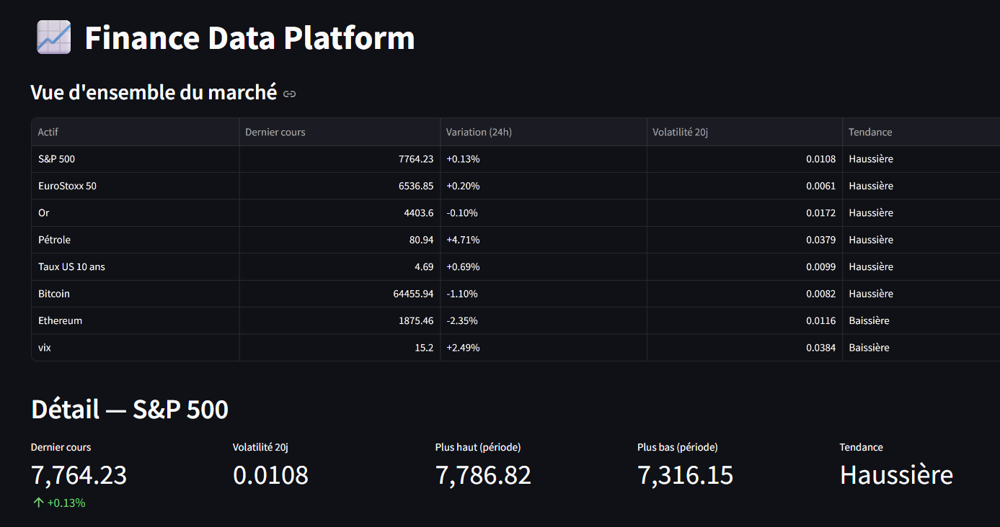
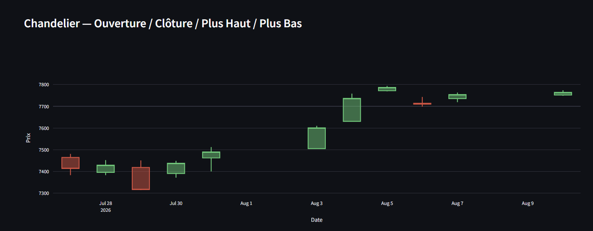

# 📈 Finance Data Platform — Pipeline Data Engineering Multi-Actifs

Un projet de data engineering de niveau ING3 (ECE Paris), axé sur l'ingestion, la transformation et l'agrégation de données financières en continu, via une architecture en couches et une orchestration autonome.

Finance Data Platform est un pipeline ETL construit autour de huit actifs représentatifs (actions, matières premières, taux, cryptomonnaies, indicateur de volatilité), conçu pour tourner de façon totalement autonome sur un poste de travail personnel — sans dépendre d'un serveur toujours allumé. Le système extrait quotidiennement les cours de marché, les nettoie et les enrichit, puis calcule des indicateurs de risque et de corrélation inter-actifs, restitués dans un dashboard interactif de niveau trading.

---

## 🏗️ Architecture en Couches (Medallion Pattern)

Le pipeline suit une architecture médaillon Bronze / Silver / Gold, standard en data engineering pour séparer strictement donnée brute et donnée transformée :

| Couche | Rôle | Opérations |
|---|---|---|
| **Bronze** | Ingestion brute | Extraction yfinance, aucune transformation, Parquet partitionné par date |
| **Silver** | Nettoyage & enrichissement | Déduplication, filtrage des valeurs aberrantes, rendements log, moyennes mobiles (20/50j), volatilité glissante (20j) |
| **Gold** | Agrégation analytique | Alignement calendaire multi-marchés, corrélations glissantes 30 jours entre chaque paire d'actifs |

Flux de données :

    [APIs de marché] ──▶ [BRONZE : ingestion brute, Parquet]
                               │
                               ▼
                      [SILVER : nettoyage, alignement calendaire, rendements, moyennes mobiles]
                               │
                               ▼
                      [GOLD : corrélations glissantes 30j, agrégats entre actifs]
                               │
                               ▼
                      [Dashboard Streamlit]

* **Bronze** conserve les données telles que renvoyées par l'API, sans altération, en accumulant à chaque run une fenêtre glissante de quelques jours — garantissant qu'on puisse toujours revenir à la source si une étape de traitement doit être revue.
* **Silver** ne se contente pas de nettoyer un run isolé : elle reconstitue l'**historique complet** en agrégeant tous les fichiers Bronze accumulés au fil des exécutions, seule façon de calculer des moyennes mobiles ou une volatilité qui aient un sens.
* **Gold** croise l'ensemble des actifs suivis et gère un problème structurel du sujet : les marchés traditionnels ferment le week-end, la cryptomonnaie trade en continu. Les calendriers sont alignés par forward-fill avant tout calcul de corrélation — une limite assumée et documentée plutôt que masquée.

---

## 💹 Actifs Suivis

Un actif par grande classe, pour observer des dynamiques et des corrélations réellement différentes plutôt que des variantes d'un même marché :

* **Actions** : S&P 500 (`^GSPC`), EuroStoxx 50 (`^STOXX50E`)
* **Matières premières** : Or (`GC=F`), Pétrole (`CL=F`)
* **Taux** : US 10 ans (`^TNX`)
* **Cryptomonnaies** : Bitcoin (`BTC-USD`), Ethereum (`ETH-USD`)
* **Sentiment de marché** : VIX (`^VIX`), indice de volatilité implicite du S&P 500, utilisé comme baromètre de la peur

---

## ⚙️ Orchestration & Automatisation

Le pipeline est orchestré par **Apache Airflow**, avec un enchaînement automatique des trois couches via `TriggerDagRunOperator` : `extract_bronze_daily` déclenche `transform_silver_daily`, qui déclenche à son tour `aggregate_gold_daily`, chaque DAG ne se déclenchant qu'à la réussite du précédent.

**Un choix d'orchestration adapté à une contrainte réelle** : les DAGs n'ont pas de planning cron fixe (`schedule=None`). Le poste de travail n'étant pas allumé en permanence — usage en veille/déverrouillage plutôt que serveur 24/7 — un cron à heure fixe n'aurait aucun sens. L'extraction est déclenchée par une tâche planifiée Windows sur l'événement de **déverrouillage de session** (`SessionStateChangeTrigger`), plus représentatif de l'usage réel qu'une simple ouverture de session.

**Robustesse face aux déclenchements multiples** : un poste déverrouillé plusieurs fois par jour peut produire des runs rapprochés. Deux protections mises en place :
* `max_active_runs=1` sur le DAG Bronze, pour empêcher deux exécutions concurrentes du même DAG.
* **Écriture via fichier temporaire local au conteneur** avant copie finale vers le volume partagé, plutôt qu'une écriture ou un renommage direct sur le volume monté depuis Windows — après avoir constaté que ni l'atomicité du rename ni `shutil.move` ne fonctionnent de façon fiable sur ce type de montage cross-filesystem.

**Cohérence des dépendances entre environnements** : une divergence de version de `pyarrow` entre le conteneur (Linux, installé via `requirements.txt`) et la machine locale (Windows) a provoqué une corruption silencieuse des fichiers Parquet — les métadonnées écrites par une version n'étaient pas relisibles par l'autre, entraînant des erreurs `Repetition level histogram size mismatch` à la lecture. Diagnostiqué en comparant explicitement les versions installées de part et d'autre, puis résolu en épinglant une version exacte (`pyarrow==19.0.0`) dans `requirements.txt`, garantissant que conteneur et environnement local utilisent strictement la même version.

Le pipeline est **idempotent** : des déclenchements multiples dans la même journée ne dupliquent jamais de données, grâce à la déduplication systématique en Silver.

---

## 📊 Dashboard

Un dashboard **Streamlit** conçu pour être lisible par n'importe qui, pas seulement un public technique :

* **Vue d'ensemble du marché** : tableau comparatif de tous les actifs (dernier cours, variation 24h, volatilité, tendance)
* **Vue thermique (treemap)** : façon Finviz, chaque actif coloré selon sa variation du jour
* **KPI par actif** : dernier cours, variation, volatilité 20j, plus haut/plus bas sur la période, tendance
* **Chandelier japonais** : ouverture/clôture/plus haut/plus bas, standard de lecture en finance
* **Performance comparée (base 100)** : tous les actifs normalisés pour comparer leur performance relative sur la période
* **Baromètre de la peur (VIX)** : jauge visuelle avec zones (calme/normal/tension/panique)
* **Corrélation live** : heatmap calculée sur la période sélectionnée, en complément de la version Gold (rolling 30j) qui prend le relais une fois l'historique suffisant
* **Actualités récentes** : dernières news liées à l'actif sélectionné, via l'API `yfinance`
* **Section debug/transparence** : données Bronze brutes exposées, pour vérifier visuellement l'intégrité du pipeline d'ingestion

*Point d'attention assumé* : la section actualités effectue un appel réseau direct au moment de l'affichage, hors du pipeline Bronze/Silver/Gold — un compromis pragmatique pour de la fraîcheur d'info, qui casse volontairement la logique "tout est versionné et reproductible" appliquée au reste du projet.

---

## 🧪 Tests

Suite de tests unitaires (**pytest**) couvrant les fonctions critiques du pipeline :
* Nettoyage et déduplication de l'historique (Silver)
* Calcul des rendements, moyennes mobiles et volatilité
* Alignement calendaire multi-marchés (Gold)
* Calcul des corrélations glissantes
* **Test de régression sur l'écriture atomique des fichiers Parquet**, ajouté suite à un bug de corruption rencontré en conditions réelles (voir section Orchestration)

    pytest tests/ -v

---

## 🔧 Choix Techniques

* **Airflow** pour l'orchestration : retries natifs, logs centralisés, dépendances explicites entre couches — préférable à un simple script séquentiel dès que le pipeline gagne en complexité.
* **Parquet** plutôt que CSV : format colonnaire compressé, qui conserve les types de données.
* **Pas de Spark** : le volume (8 tickers, historique quotidien) tient largement en mémoire sur une seule machine — Spark ajouterait de la complexité sans bénéfice réel.
* **DuckDB envisagé pour une V2** de la couche Gold (requêtes analytiques plus riches) — non implémenté pour l'instant, Pandas/Parquet suffisant au volume actuel.
* **Docker Compose** pour la reproductibilité : l'ensemble du pipeline (Airflow inclus) se lance en une seule commande, `restart: unless-stopped` pour survivre aux redémarrages du poste.

---

## 🗂️ Stack Technique

| Composant | Outil |
|---|---|
| Extraction | Python, yfinance |
| Orchestration | Apache Airflow |
| Stockage | Parquet |
| Traitement | Pandas, NumPy |
| Dashboard | Streamlit, Plotly |
| Tests | pytest |
| Conteneurisation | Docker / Docker Compose |
| Automatisation | Tâche planifiée Windows (déverrouillage de session) |

---

## 📁 Structure du Projet

    finance-data-platform/
    ├── config/                 # configuration (tickers suivis)
    ├── dags/                   # DAGs Airflow (extract_bronze, transform_silver, aggregate_gold)
    ├── src/                    # logique métier (extraction, transformation, agrégation)
    ├── dashboard/               # application Streamlit
    ├── scripts/                 # utilitaires de debug (inspection des sorties par couche)
    ├── tests/                   # tests unitaires (pytest)
    ├── data/                    # données générées (non versionnées) : bronze/, silver/, gold/
    ├── docker-compose.yml
    ├── pytest.ini
    ├── trigger_pipeline.ps1     # script de déclenchement (tâche planifiée Windows)
    └── task_backup.xml          # configuration de référence de la tâche planifiée

---

### Aperçu visuel

**Vue d'ensemble du marché et vue thermique**

**Chandelier japonais — détail d'un actif**

---

## 🚀 Lancement Rapide

1. Cloner le dépôt :

       git clone https://github.com/paulfvt/finance-data-platform.git
       cd finance-data-platform

2. Démarrer Airflow avec Docker :

       docker compose up -d

3. Lancer le dashboard Streamlit :

       pip install -r requirements.txt
       streamlit run dashboard/app.py

4. Lancer les tests :

       pytest tests/ -v

---
*Projet en développement continu — l'historique s'accumule quotidiennement ; la couche Gold devient pleinement significative à partir de 30 jours de données.*
